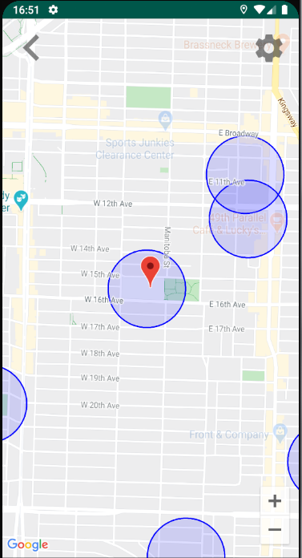

# WatchOut
Android Project

Description: App notifies the user when entering a school zone in the vancouver city. User can select the distance away from school to be notified and also how to be notified.

Tech stack: Java, Android studio

